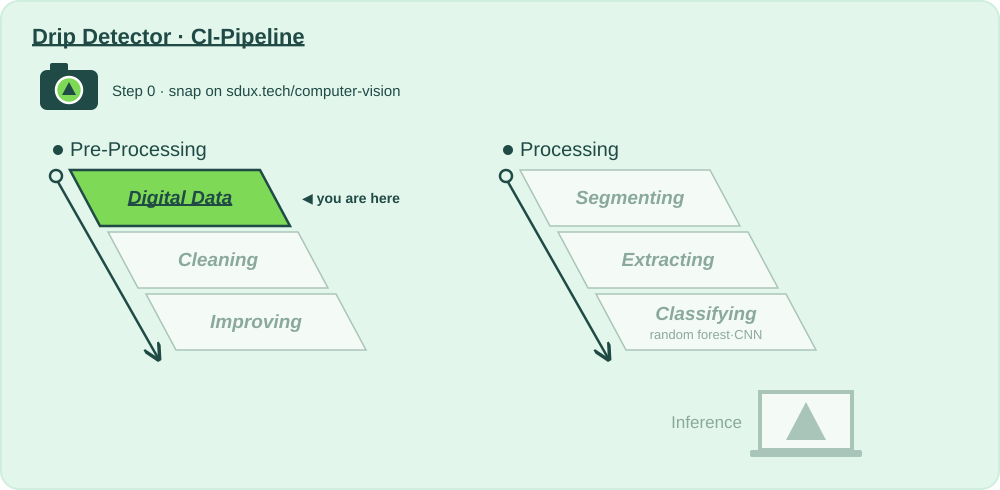

# 📷 Stage 1 · Digital Data

**Lecture:** Introduction to Image Processing · Tue 22.09 · **The question:** *Can we turn whatever the camera gives us into one consistent format?*

## Why?

📍 **Where we are:** Pre-Processing, stage 1: **Digital Data**, the first stop after the camera (Step 0).
On the layer diagram: Natural Scene → **Digital Data** → Preparing for Analysis → Model Training → Inference.

The investors' demo is a camera clipped to an IV drip chamber. But "the camera" is really many cameras: every hospital mounts it differently, some sideways, some in colour, all at different resolutions. A model can only learn from data that looks the same every time.

Digital Data turns whatever arrives, including the photo you snap in Step 0, into one small grid of numbers: 128 × 128 grey values. It also locks away a test set on day one that no model will ever train on, so every accuracy we report later is honest.

In 1957 Russell Kirsch scanned the first digital photograph: his baby son, 176 × 176 pixels. Our frames are smaller than that, and a runner in a data centre prepares hundreds of them per second.

**Without this stage:** every later stage has to cope with every camera, and nobody can trust the test score.

## How?

This folder is the whole stage:

| File | |
|---|---|
| 📖 `README.md` | you are here: why, and what to try |
| 🎛️ [`action.yaml`](action.yaml) | **this stage's values**: every one you may change, with the mathematician who thought of it, and the 🚦 gates |
| 🐍 [`digital_data.py`](digital_data.py) | **the code CI runs**: rotate → crop → resize → colour space, and the locked test set, written to be read top to bottom |

Run it: **▶ `digital_data.py` in PyCharm**, or `python 1_digital-data/digital_data.py`. It runs the stages before it if their output is out of date, then this one. You get, in `build/digital_data/`:

- **`report.md`**: the values you passed in, every number with 🟢 🟠 🔴 and what it means, the gates, what to try next, and **what changed since your last run**
- **`before_after.png`**: your snap and one test frame per class, after every step

That's exactly what CI shows for this stage when you push, or when you paste a photo URL into **Actions → 🚀 CI-Pipeline → Run workflow**.

## What?

### Step 0 · Snap 📸
- [ ] Take a photo of what your product should recognise, and put it in [`images_for_analyzing/`](../images_for_analyzing/) (or paste its URL into **Run workflow**).

### Step 1 · Input 📥
Nothing yet: this is the first stage. Its input is the **Natural Scene** itself: the synthetic day-zero dataset (`source: "synthetic"`), your own images in [`images_for_training/<class>/`](../images_for_training/) (`source: "folder"`), and your snap.

### Step 2 · Change a value, run, compare 🎛️
One value at a time in [`action.yaml`](action.yaml), ▶, then read *Since your last run* in the report. Start with the first one.

- [ ] `size: "[32, 32]"`: is the drop still there in `before_after.png`? Nyquist and Shannon say it can't be. Put it back afterwards; every later stage feels this change.
- [ ] At `size: "[64, 64]"`, compare `interpolation: "nearest"` with `"area"`. Look for jagged edges (aliasing).
- [ ] `color_space: "hsv"` with `channel: "2"`, then `"lab"` with `channel: "0"`. Which looks most like the grey version, and why?
- [ ] Bring your own classes: images in [`images_for_training/<class>/`](../images_for_training/), then `source: "folder"` and `group_by: "prefix"`. The whole route: ❓ [How to add my own classes?](../how-to/add-my-own-classes.md)

### Step 3 · Analyse, and decide if we pass on 🚦
- [ ] 🚦 **Gates:** at least 30 frames per class, zero unreadable files.
- [ ] Are the classes balanced? Is the train/test split the same after every run (same `seed`)?
- [ ] Look at your snap's 128 × 128 version in `before_after.png`. Is the information you need still in there?

**Ready to pass on to Cleaning?** Gates green, and you'd recognise the drop in the pipeline's version yourself. → push, open a pull request: *"Digital Data: what I changed and why"*.

### Going further: change the code
The values choose between methods somebody already wrote; [`digital_data.py`](digital_data.py) is where they live. Add a step to `prepare()`, say a flip for a camera mounted upside down, and give it a value in `action.yaml`.

⬅️ [The whole pipeline](../README.md)
