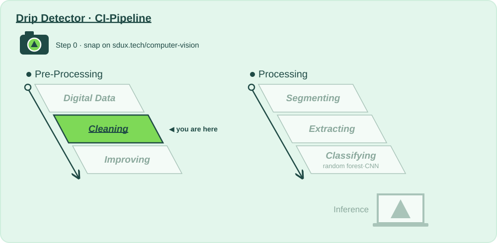

# 🧽 Stage 2 · Cleaning

**Lecture:** Image Preprocessing Methods · Thu 24.09 · **The question:** *Our clip-on camera is cheap. Can we trust its pixels?*

## Why?

📍 **Where we are:** Pre-Processing, stage 2: **Cleaning**, right after Digital Data.
On the layer diagram: Natural Scene → Digital Data → **Preparing for Analysis** → Model Training → Inference.

The clip-on camera costs a few euros, and it shows: sensor noise, dead pixels, JPEG blocks, blur. And the thing we care about, a falling drop, is only a few pixels tall.

Cleaning removes what the camera added without removing the drop. Every filter trades noise for detail, so this stage watches both.

**Without this stage:** segmentation mistakes noise for drops.

## How?

This folder is the whole stage:

| File | |
|---|---|
| 📖 `README.md` | you are here: why, and what to try |
| 🎛️ [`action.yaml`](action.yaml) | **the values**: every one you may change, with the mathematician who thought of it, and the 🚦 gates |
| 🐍 [`cleaning.py`](cleaning.py) | **the code CI runs**: gaussian, median, bilateral or nlmeans, and how much noise is left, written to be read top to bottom |

Run it: **▶ `cleaning.py` in PyCharm**, or `python 2_cleaning/cleaning.py`. It runs the stages before it if their output is out of date, then this one. You get, in `build/cleaning/`:

- **`report.md`**: the values you passed in, every number with 🟢 🟠 🔴 and what it means, the gates, what to try next, and **what changed since your last run**
- **`before_after.png`**: your snap and one test frame per class, after every step

That's exactly what CI shows for this stage when you push, or when you paste a photo URL into **Actions → 🚀 CI-Pipeline → Run workflow**.

## What?

### Step 0 · Snap 📸
- [ ] Take a photo of what your product should recognise, and put it in `snaps/` (or paste its URL into **Run workflow**).

### Step 1 · Input 📥
What stage 1 passed on: 128 × 128 grey frames. About a third of them carry camera damage: Gaussian sensor noise, salt-and-pepper dead pixels, motion blur or JPEG blocks.

### Step 2 · Change a value, run, compare 🎛️
One value at a time in [`action.yaml`](action.yaml), ▶, then read *Since your last run* in the report. Start with the first one.

- [ ] `method: "none"`: watch the noise gate fail. That's what the cheap camera really delivers.
- [ ] `median` against `gaussian` at `kernel: "3"`: which one removes the dead pixels? Look at the *removed (×4)* column.
- [ ] `kernel: "7"`: the noise drops further. Now look at the drop itself, and at the forest's test accuracy (`python run_pipeline.py`).
- [ ] Chain filters: `method: "[median, gaussian]"`. Try `bilateral` and `nlmeans`, and compare **ms per frame**. Would nlmeans run on a clip-on camera?

### Step 3 · Analyse, and decide if we pass on 🚦
- [ ] 🚦 **Gate:** estimated noise σ after cleaning ≤ 4.0.
- [ ] Compare *sharpness before* and *after*. Did you smooth away the drop together with the noise?
- [ ] A gate can pass while the product gets worse. Check the test accuracy before you celebrate.

**Ready to pass on to Improving?** Gate green, sharpness still reasonable, accuracy not worse. → push, open a pull request: *"Cleaning: what I changed and why"*.

### Going further: change the code
The values choose between methods somebody already wrote; [`cleaning.py`](cleaning.py) is where they live. Add a filter of your own to `clean()`, say `cv2.blur` (a plain average), and compare it with Gauss's weighted one.

⬅️ [The whole pipeline](../README.md)
