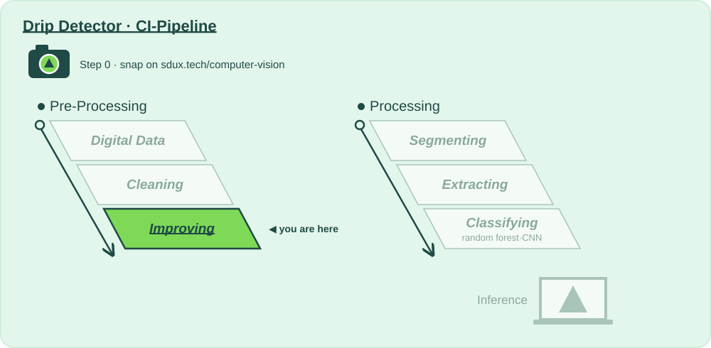

# 🔆 Stage 3 · Improving

**Lecture:** Image Preprocessing Methods · Thu 24.09 · **The question:** *Night shift on the ward: will we still see anything in dim light?*

## Why?

📍 **Where we are:** Pre-Processing, stage 3: **Improving**, right after Cleaning.
On the layer diagram: Natural Scene → Digital Data → **Preparing for Analysis** → Model Training → Inference.

At night on the ward, frames are so dim that everything sits in a narrow band of grey. Improving stretches the dark frames back out and finds the edges, so the stages after it can see the chamber at 3 a.m. as well as at noon.

**Without this stage:** the night shift sees nothing at all.

## How?

This folder is the whole stage:

| File | |
|---|---|
| 📖 `README.md` | you are here: why, and what to try |
| 🎛️ [`action.yaml`](action.yaml) | **this stage's values**: every one you may change, with the mathematician who thought of it, and the 🚦 gates |
| 🐍 [`improving.py`](improving.py) | **the code CI runs**: equalize, CLAHE, stretch or gamma, then Canny's edges, written to be read top to bottom |

Run it: **▶ `improving.py` in PyCharm**, or `python 3_improving/improving.py`. It runs the stages before it if their output is out of date, then this one. You get, in `build/improving/`:

- **`report.md`**: the values you passed in, every number with 🟢 🟠 🔴 and what it means, the gates, what to try next, and **what changed since your last run**
- **`before_after.png`**: your image for analyzing and one test frame per class, after every step

That's exactly what CI shows for this stage when you push, or when you paste a photo URL into **Actions → 🚀 CI-Pipeline → Run workflow**.

## What?

### Step 0 · Image for analyzing 📸
- [ ] Take a photo of what your product should recognise, and put it in [`images_for_analyzing/`](../images_for_analyzing/) (or paste its URL into **Run workflow**).

### Step 1 · Input 📥
What stage 2 passed on: denoised frames. Almost half of them were shot on the night shift: dim, with every value squeezed into a narrow band of grey.

### Step 2 · Change a value, run, compare 🎛️
One value at a time in [`action.yaml`](action.yaml), ▶, then read *Since your last run* in the report. Start with the first one.

- [ ] `method: "none"`: the dim-contrast gate fails… but run the whole pipeline: the accuracy may go *up*. HOG normalises contrast per block (stage 5). So who is right, the gate or the accuracy? Bring your answer to class.
- [ ] `equalize` against `clahe` on the dim frames in `before_after.png`. Then `clahe_clip` at 1, 2 and 4: where does noise start to bloom?
- [ ] `method: "gamma"` with `gamma: "0.5"`: brighter shadows, but is it better?
- [ ] Canny at `canny_low: "20"`, `canny_high: "60"` against `100` / `200`. Then `pass_on: "edges"` and follow the consequences downstream.

### Step 3 · Analyse, and decide if we pass on 🚦
- [ ] 🚦 **Gate:** brightness σ of the dimmest 5 % of frames ≥ 15.
- [ ] Look at the dimmest frames in `before_after.png`. Would a nurse see anything on the night shift?

**Ready to pass on to Segmenting?** Gate green and the night frames readable. → push, open a pull request: *"Improving: what I changed and why"*.

### Going further: change the code
The values choose between methods somebody already wrote; [`improving.py`](improving.py) is where they live. Add your own curve to `enhance()`, say a logarithm that lifts the darkest greys most, and compare it with gamma.

⬅️ [The whole pipeline](../README.md)
