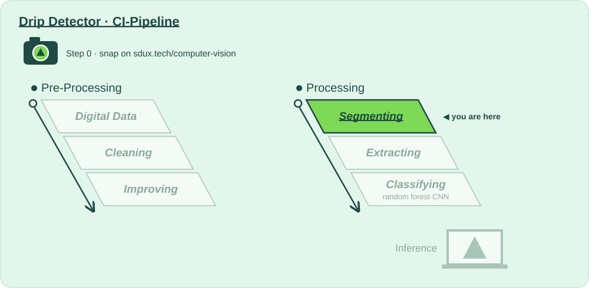

# ✂️ Stage 4 · Segmenting

**Lecture:** Image Segmentation · Tue 29.09 · **The question:** *Which pixels belong to the drip chamber, and which are just background?*

## Why?

📍 **Where we are:** Processing, stage 4. Pre-Processing hands over here, from *make the image good* to *understand what's in it*.
On the layer diagram: Natural Scene → Digital Data → **Preparing for Analysis** → Model Training → Inference.

Until now every pixel counted the same. But the drip chamber is only part of the frame; the rest is wall, stand and tubing.

Segmenting decides which pixels belong to the object: the chamber, the fluid, the falling drop. That way the features of stage 5 describe the chamber, not the wallpaper, and a model can't cheat by learning the background.

**Without this stage:** the model learns whatever is easiest to see, and that's rarely the drop.

## How?

This folder is the whole stage:

| File | |
|---|---|
| 📖 `README.md` | you are here: why, and what to try |
| 🎛️ [`action.yaml`](action.yaml) | **this stage's values**: every one you may change, with the mathematician who thought of it, and the 🚦 gates |
| 🐍 [`segmenting.py`](segmenting.py) | **the code** CI runs, written to be read top to bottom: 4a threshold → 4b morphology → 4c contours → 4d boundary |

Run it: **▶ `segmenting.py` in PyCharm**, or `python 4_segmenting/segmenting.py`. It runs the stages before it if their output is out of date, then this one, on every frame and on your snap. You get, in `build/segmenting/`:

- **`report.md`**: the values you passed in, every number with 🟢 🟠 🔴 and what it means, the gates, what to try next, and **what changed since your last run**
- **`before_after.png`**: your snap and one test frame per class, after every step

That's exactly what CI shows for this stage when you push, or when you paste a photo URL into **Actions → 🚀 CI-Pipeline → Run workflow**.

## What?

### Step 0 · Snap 📸
- [ ] Take a photo of something this stage should cut out, and put it in [`images_for_analyzing/`](../images_for_analyzing/) (or paste its URL into **Run workflow**).

### Step 1 · Input 📥
What stage 3 · Improving passed on: enhanced frames with decent contrast, even from the night shift. It's the first column of `before_after.png`.

### Step 2 · Change a value, run, compare 🎛️
One value at a time in [`action.yaml`](action.yaml), ▶, then read *Since your last run* in the report and look at the picture. Start with the first one.

- [ ] `threshold: "otsu"` against `"adaptive"`. Look at the corners of the frames in `before_after.png`: what does one threshold for the whole frame do with uneven light?
- [ ] `morphology`: `"[open]"`, `"[close]"`, `"[open, close]"`, `"[close, open]"`, and `morph_kernel: "5"`. Which removes specks, which closes gaps? Is the order the same both ways?
- [ ] `min_contour_area: "150"`: the specks disappear… and so might the drop. It's small.
- [ ] `fill_holes: "false"`: outlines only. What changes for the features in stage 5?
- [ ] `boundary: "inner"`: pass on only the crust of every object. Does the classifier need the inside?
- [ ] `pass_on`: `crop` zooms in on the biggest object, `mask` passes only the shape, `original` ignores the segmentation. Run `python run_pipeline.py --from segmenting` and compare the forest's test accuracy for each.

### Step 3 · Analyse, and decide if we pass on 🚦
- [ ] 🚦 **Gates:** at most 5 % of frames with an empty mask, at most 5 % with a full one.
- [ ] Is the chamber in *your* snap cut out, or the wall behind it?

**Ready to pass on to Extracting?** Gates green and the outlines hug the chamber → push, open a pull request: *"Segmenting: what I changed and why"*.

### Going further: change the code
The values choose between methods somebody already wrote; [`segmenting.py`](segmenting.py) is where they live. Add your own, say a `"kmeans"` branch in `threshold()` that sorts pixels into two brightness clusters, then set `threshold: "kmeans"`. ▶ shows you what it does; the gates decide whether it ships.

⬅️ [The whole pipeline](../README.md)
