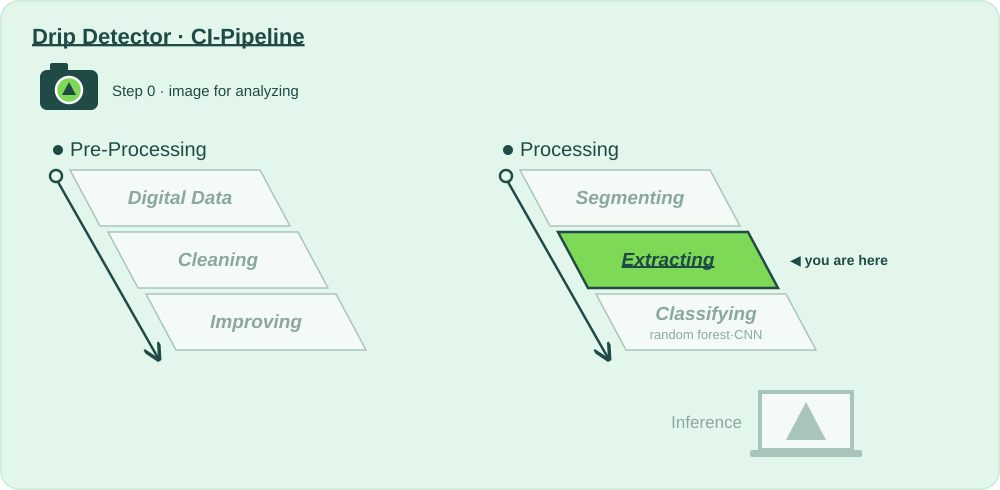

# 🧬 Stage 5 · Extracting

**Lecture:** Feature Extraction and Data Preparation · Thu 01.10 · **The question:** *How do we describe a frame with numbers a model can learn from?*

## Why?

📍 **Where we are:** Processing, stage 5: **Extracting**, the last step before a model sees anything.
On the layer diagram: Natural Scene → Digital Data → **Preparing for Analysis** → Model Training → Inference.

A random forest can't look at a picture. It needs numbers that mean something: which way the edges point (HOG) and which textures sit where (LBP). This stage turns 16 384 pixels into a few thousand meaningful numbers and puts them all on the same scale.

A startup never has enough labelled data, so we also invent extra training frames with augmentation. Two rules keep us honest: augment the training set only, and fit the scaler on training data only. Break them and the test score lies, and you'll find out in the hospital instead of in CI.

**Without this stage:** the model gets 16 384 raw numbers per frame and 270 examples to learn from.

## How?

This folder is the whole stage:

| File | |
|---|---|
| 📖 `README.md` | you are here: why, and what to try |
| 🎛️ [`action.yaml`](action.yaml) | **this stage's values**: every one you may change, with the mathematician who thought of it, and the 🚦 gates |
| 🐍 [`extracting.py`](extracting.py) | **the code CI runs**: 5d augmentation → 5a HOG and 5b LBP → 5c scaling, written to be read top to bottom |

Run it: **▶ `extracting.py` in PyCharm**, or `python 5_extracting/extracting.py`. It runs the stages before it if their output is out of date, then this one. You get, in `build/extracting/`:

- **`report.md`**: the values you passed in, every number with 🟢 🟠 🔴 and what it means, the gates, what to try next, and **what changed since your last run**
- **`before_after.png`**: your image for analyzing and one test frame per class, after every step

That's exactly what CI shows for this stage when you push, or when you paste a photo URL into **Actions → 🚀 CI-Pipeline → Run workflow**.

## What?

### Step 0 · Image for analyzing 📸
- [ ] Take a photo of what your product should recognise, and put it in [`images_for_analyzing/`](../images_for_analyzing/) (or paste its URL into **Run workflow**).

### Step 1 · Input 📥
What stage 4 passed on: frames with the background masked away.

### Step 2 · Change a value, run, compare 🎛️
One value at a time in [`action.yaml`](action.yaml), ▶, then read *Since your last run* in the report. Start with the first one.

- [ ] `features: "[lbp]"` only, then `"[hog]"` only, then add `histogram` or `pixels`. Which feature carries the drop?
- [ ] `hog_pixels_per_cell`: 32, 8 and 4. Watch the vector length, the gate (the camera chip's memory) and the accuracy.
- [ ] `scaling`: `none`, `minmax`, `standard`. Read *loudest 10 % of features* in the report, then the forest's test accuracy (`python run_pipeline.py --from extracting`). The numbers change, the accuracy doesn't: why don't trees care about scaling?
- [ ] `augment_copies`: 0 against 3. More data, or just more of the same?
- [ ] `augment_flip_vertical: "true"`: drops falling upwards (see the augmented column). What happens to the accuracy?

### Step 3 · Analyse, and decide if we pass on 🚦
- [ ] 🚦 **Gates:** feature vector ≤ 20 000 numbers, and no NaN values.
- [ ] Check that augmentation touched the training frames only: the test count in the report must not change.

**Ready to pass on to Classifying?** Gates green, vector small enough for the chip. → push, open a pull request: *"Extracting: what I changed and why"*.

### Going further: change the code
The values choose between methods somebody already wrote; [`extracting.py`](extracting.py) is where they live. Add a feature of your own to `extract()`, say `"edges"`: the share of Canny edge pixels per cell. Did the forest find it worth its numbers?

⬅️ [The whole pipeline](../README.md)
