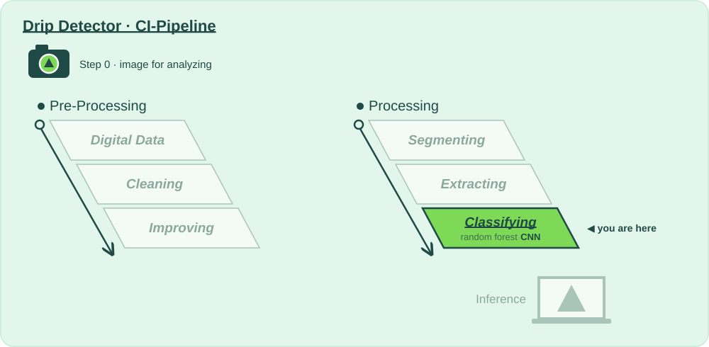

# 🧠 Stage 6 · Classifying · Neural Network

**Lecture:** Image Classification with Neural Networks · Thu 08.10 · **The question:** *Can a network learn its own features, straight from the pixels?*

## Why?

📍 **Where we are:** Processing, stage 6: **Classifying**, with a convolutional neural network running next to the forest.
On the layer diagram: Natural Scene → Digital Data → Preparing for Analysis → **Model Training** → Inference.

The forest only sees what we told it to look at in stage 5. A convolutional neural network learns its own filters, straight from the segmented pixels.

Both run in the same pipeline, so every run is a head-to-head. Out of the box, on 360 frames, the network loses (about 79 % against 97 %). Why, and what it would take to win, is this week's lesson: data, overfitting, and why graphics cards changed everything.

**Without this stage:** we never find out whether the modern approach is actually better for *our* product.

## How?

This folder is the whole stage:

| File | |
|---|---|
| 📖 `README.md` | you are here: why, and what to try |
| 🎛️ [`action.yaml`](action.yaml) | **this stage's values**: every one you may change, with the mathematician who thought of it, and the 🚦 gates |
| 🐍 [`neural_network.py`](neural_network.py) | **the code CI runs**: the network (`build_network`), how it learns (`train`), and the export for a phone, written to be read top to bottom |

Run it: **▶ `neural_network.py` in PyCharm**, or `python 6_neural-network/neural_network.py`. It runs the stages before it if their output is out of date, then this one. You get, in `build/neural_network/`:

- **`report.md`**: the values you passed in, every number with 🟢 🟠 🔴 and what it means, the gates, what to try next, and **what changed since your last run**
- **`before_after.png`**: the confusion matrix, how the model learned, and the test frames it got wrong

That's exactly what CI shows for this stage when you push, or when you paste a photo URL into **Actions → 🚀 CI-Pipeline → Run workflow**.

## What?

### Step 0 · Snap 📸
- [ ] Take a photo of what your product should recognise, and put it in [`images_for_analyzing/`](../images_for_analyzing/) (or paste its URL into **Run workflow**).

### Step 1 · Input 📥
Also what stage 5 passed on, but a different part of it: the network ignores the feature vectors and learns from the segmented **pixels** (`I_train`, `I_test`, `I_snap`). It needs TensorFlow: `pip install -r requirements-cnn.txt`, and `enabled: "true"`.

### Step 2 · Change a value, run, compare 🎛️
One value at a time in [`action.yaml`](action.yaml), ▶, then read *Since your last run* in the report. Start with the first one.

- [ ] `enabled: "true"`, ▶, and watch it fail the accuracy gate. The middle panel of `before_after.png` is the learning curve: near 100 % on the frames it learns from, far below on the ones that sit out. That's memorising.
- [ ] Fight it: `dropout: "0.5"`, `head: "gap"` (read *parameters* in the report first: where are the weights?), fewer `epochs` (the report says where it started memorising), or more data with `augment_copies: "3"` in stage 5.
- [ ] `batch_norm: "true"`: does it help here? Why might it struggle with so few frames?
- [ ] `input_downscale` at 1 and 4. Compare *training seconds* with the forest. Now imagine an NVIDIA GPU: this is why deep learning waited until 2012.

### Step 3 · Analyse, and decide if we pass on 🚦
- [ ] 🚦 **Gates:** the same promises as the forest: accuracy ≥ 0.85, worst-class recall ≥ 0.75.
- [ ] Beat the forest, or explain why you can't with 360 frames.
- [ ] On a phone? `export: "tflite_quantized"`, and read ❓ [How to export a tflite file from our pipeline?](../how-to/export-a-tflite-file.md) before you promise anyone an app.

**Ready to ship?** A model that doesn't beat the forest doesn't ship, however modern it is. Keep `enabled: "true"` only when its gates pass. → push, open a pull request: *"Neural Network: what I changed and why"*.

### Going further: change the code
The values choose between methods somebody already wrote; [`neural_network.py`](neural_network.py) is where they live. Change the architecture in `build_network()`: add a layer, replace `MaxPooling2D` with a convolution with `strides=2`, or stop at the best epoch with `tf.keras.callbacks.EarlyStopping` in `train()`.

⬅️ [The whole pipeline](../README.md)
