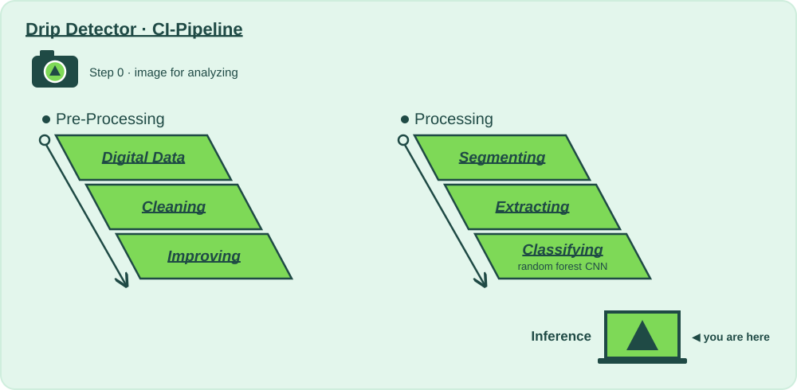

# 🎤 Stage 7 · Demo Day

**Lecture:** Course Summary · Tue 13.10 · **The question:** *What do we show the investors (and the hospital)?*

## Why?

📍 **Where we are:** The whole pipeline, and its last layer: **Inference**, the laptop at the bottom of the slide.
On the layer diagram: Natural Scene → Digital Data → Preparing for Analysis → Model Training → **Inference**.

Inference is the moment that matters: a model makes a call on a frame it has never seen, and a nurse gets told.

Demo Day collects every stage's metrics, gates and previews into one page, shows your snap's journey from camera to prediction. It's what you show the investors on Tuesday 13.10, and the exam on Thursday 15.10 walks the same pipeline: why, how and what, stage by stage.

**Without this stage:** a pile of green checkmarks that nobody outside the team understands.

## How?

This folder is the whole stage:

| File | |
|---|---|
| 📖 `README.md` | you are here: why, and what to try |
| 🎛️ [`action.yaml`](action.yaml) | **the values**: every one you may change, with the mathematician who thought of it, and the 🚦 gates |
| 🐍 [`demo_day.py`](demo_day.py) | **the code CI runs last**: one page from every stage's report and picture, written to be read top to bottom |

Run it: **▶ `demo_day.py` in PyCharm** after the pipeline ran, or `python 7_demo-day/demo_day.py`. You get `build/demo_day/index.html`: the whole run on one page, which CI publishes on GitHub Pages.

## What?

### Step 0 · Snap 📸
- [ ] Take a photo of what your product should recognise, and put it in `snaps/` (or paste its URL into **Run workflow**).

### Step 1 · Input 📥
Every stage's output. Demo Day runs even when a gate failed, so the page always shows where the pipeline stopped.

### Step 2 · Change a value, run, compare 🎛️
One value at a time in [`action.yaml`](action.yaml), ▶, then read *Since your last run* in the report. Start with the first one.

- [ ] Name your startup and write a pitch an investor remembers: `project_name`, `pitch`.
- [ ] Snap three photos, one of each class. How many does the pipeline get right? Real photos against synthetic training data: that gap has a name, *domain shift*.
- [ ] Where does the time go? Compare the durations of every stage on the page.
- [ ] Put the page online: **Settings → Pages → Source: GitHub Actions**, then add the repository variable `ENABLE_PAGES` = `true`.

### Step 3 · Analyse, and decide if we pass on 🚦
- [ ] 🚦 Every gate green? The page's verdict says **"Every gate passed. Ship it."**
- [ ] For every stage, one sentence each: why it exists, how you tuned it, what changed.

**Ready for the investors (Tue 13.10) and the exam (Thu 15.10)?** Three minutes: the pipeline, the one change per stage that mattered most, and the thing that surprised you.

### Going further: change the code
The values choose between methods somebody already wrote; [`demo_day.py`](demo_day.py) is where they live. The page is plain HTML built in `build_html()`: add the section your investors would ask for.

⬅️ [The whole pipeline](../README.md)
