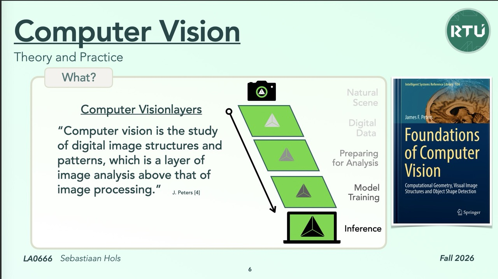

# 🚀 Your Computer Vision Company  — a computer-vision startup in a CI-pipeline

**LA0666 Computer Vision · RTU Liepāja · Fall 2026**

A template for building a computer-vision product the way a startup would: every lecture adds one stage to the product's pipeline, every push shows whether the product got better or worse, and theory and practice live in one folder per stage.

**It ships with a worked example, the Drip Detector:** a clip-on camera for an IV drip chamber that tells the nurse when an infusion **stops** or is about to **run dry**. Every stage explains itself with it, and a synthetic dataset of drip chambers makes the whole pipeline run on day one. Learn with the example; [make it yours](#make-it-yours) when you have your own idea.

<p align="center"></p>

<p align="center"></p>

## How this repository works

Every layer of the theory is a stage of our pipeline, and **every stage is a folder** with three files:

| File | |
|---|---|
| 📖 `README.md` | **Why** this stage exists, and **what** to try. Start here |
| 🎛️ `action.yaml` | **This stage's values**: every one you may change (and the mathematician who thought of it), and the 🚦 gates, the promises the stage keeps |
| 🐍 `<stage>.py` | **The code** that runs, locally and in CI. Written to be read top to bottom, the lecture in its comments |

Run a stage and it writes two things to `build/<stage>/`: **`report.md`** (the values you passed in, every number with 🟢 🟠 🔴 and what it means, the gates, what changed since your last run) and **`before_after.png`** (your photo and a few test frames, after every step). CI shows exactly the same report for every stage, and Demo Day collects them all on one web page.

That's the whole loop, folder by folder, with apologies to the Underpants Gnomes (*Step 1: collect underpants. Step 2: ? Step 3: profit.*):

* **Step 0 · Image for analyzing.** Put a photo in [`images_for_analyzing/`](images_for_analyzing/), or paste its URL into **Actions → 🚀 CI-Pipeline → Run workflow**.
* **Step 1 · Read.** The stage's README: why it exists, and what it gets from the stage before.
* **Step 2 · Change a value, run, compare.** One value in `action.yaml`, ▶ the stage's `.py`, read *Since your last run* in the report and look at the picture. Curious how it works? Read the code, and change that too.
* **Step 3 · Decide.** The gates say whether the stage is ready to pass on. Push, and CI runs every stage in a row.

Three levels, one after the other, and you can stop at any of them:

1. **Change the values.** One value in `action.yaml`, ▶, compare. Every stage README starts you here.
2. **Change the code.** Read `<stage>.py` top to bottom, then change it: add a method, a feature, a model. Each README ends with an idea under *Going further*.
3. **Change the problem.** Your own classes, your own photos: [How to add my own classes?](how-to/add-my-own-classes.md)

## Getting started

1. Click **Use this template → Create a new repository**.
2. Open the **Actions** tab. The first run starts by itself and takes a few minutes. A small *Template init* job also points every link at your own copy.
3. Open the run and read the summary: one report per stage, with a download link for its pictures.
4. **Locally, in PyCharm:** open the folder and give it its own interpreter (Settings → Project → Python Interpreter → Add Interpreter → Add Local Interpreter → Virtualenv in `.venv`), then open `requirements.txt` and click *Install requirements*. Open any stage's `.py` and click the green ▶ next to `if __name__ == "__main__":`. For the whole pipeline: ▶ `run_pipeline.py`.
5. **An experiment:** a branch, one value, a pull request. CI runs on it, and the PR template asks for your hypothesis and the numbers of `main` against your branch.
   ```bash
   git switch -c experiment/median-kernel-5
   # change ONE value, e.g. kernel in 2_cleaning/action.yaml
   git commit -am "Cleaning: median kernel 5" && git push -u origin HEAD
   ```

In a terminal (or a Codespace: the repository includes a dev container):

```bash
pip install -r requirements.txt              # add requirements-cnn.txt for the neural network
python 4_segmenting/segmenting.py            # one stage (and the ones before it, if they're out of date)
python run_pipeline.py                       # every stage, in a row, like CI
python run_pipeline.py --snap photo.jpg      # your photo through every stage
python run_pipeline.py --from segmenting     # re-run from a stage (slide numbers work too: --from 4)
```

## The stages

| | Stage | Lecture | Date | The code |
|---|---|---|---|---|
| 📷 | [1 · Digital Data](1_digital-data/) | Introduction to Image Processing | Tue 22.09 | [1_digital-data/digital_data.py](1_digital-data/digital_data.py) |
| 🧽 | [2 · Cleaning](2_cleaning/) | Image Preprocessing Methods | Thu 24.09 | [2_cleaning/cleaning.py](2_cleaning/cleaning.py) |
| 🔆 | [3 · Improving](3_improving/) | Image Preprocessing Methods | Thu 24.09 | [3_improving/improving.py](3_improving/improving.py) |
| ✂️ | [4 · Segmenting](4_segmenting/) | Image Segmentation | Tue 29.09 | [4_segmenting/segmenting.py](4_segmenting/segmenting.py) |
| 🧬 | [5 · Extracting](5_extracting/) | Feature Extraction and Data Preparation | Thu 01.10 | [5_extracting/extracting.py](5_extracting/extracting.py) |
| 🌳 | [6 · Random Forest](6_random-forest/) | Image Classification with Random Forests | Tue 06.10 | [6_random-forest/random_forest.py](6_random-forest/random_forest.py) |
| 🧠 | [6 · Neural Network](6_neural-network/) | Image Classification with Neural Networks | Thu 08.10 | [6_neural-network/neural_network.py](6_neural-network/neural_network.py) |
| 🎤 | [7 · Demo Day](7_demo-day/) | Course Summary | Tue 13.10 | [7_demo-day/demo_day.py](7_demo-day/demo_day.py) |

The random forest and the neural network run side by side after Extracting. The network is switched off until Thursday 08.10 (`enabled` in its `action.yaml`). Exam: Thu 15.10.

## Make it yours

The Drip Detector is an example: the pipeline doesn't know it's looking at drips. Four steps, in the order you'll need them:

1. **Name it.** One command changes the project's name everywhere it stands for *your* project: the README title, Demo Day's page, the pipeline pictures, the workflow and the dev container. `--dry-run` shows the list first.
   ```bash
   python -m tools.rename_project "Cow Counter" --pitch "A barn camera that counts the cows at milking time."
   ```
2. **Your images.** One folder per class in [`images_for_training/`](images_for_training/), then `source: "folder"` in [`1_digital-data/action.yaml`](1_digital-data/action.yaml). From a video to an honest test set: [How to add my own classes?](how-to/add-my-own-classes.md) The photo you want analyzed goes in [`images_for_analyzing/`](images_for_analyzing/).
3. **Retune, stage by stage.** Every stage was tuned for drip chambers. The gates tell you where your images differ: fix the first red stage, run again.
4. **Tell your story.** The stage READMEs explain *why* with the drip example, and every stage answers a drip question (`question` in [`stages/registry.py`](stages/registry.py)). Rewrite them for your product: it's the best rehearsal for Demo Day.

## Updates from the template

The template keeps improving during the course. Bring its updates into your project without losing your own work:

```bash
python -m tools.sync_template --check     # what's new in the template?
python -m tools.sync_template             # merge it, on a branch of its own
```

The first time, it links your project to the template. Every time, it merges on a new branch (`template-sync/<date>`), so `main` stays as it is: run the pipeline, push the branch, open a pull request, merge when CI is green. Where you and the template changed the same lines (usually a stage value), it stops and lets you choose: keep your own stage values. Pipeline pictures it redraws with your project's name by itself.

## ❓ How To's

Questions that cross every stage, answered step by step, with forks for what you might see on the way. [All How To's](how-to/)

| ❓ How to… | |
|---|---|
| [add my own classes?](how-to/add-my-own-classes.md) | 🎬 film → frames → `images_for_training/` → an honest test set |
| [train our model on cows?](how-to/train-our-model-on-cows.md) | 🔍 read the mistakes, find the stage at fault, fix one thing |
| [pick which model I am training?](how-to/pick-which-model-i-am-training.md) | ⚖️ forest or network, with numbers |
| [export a tflite file from our pipeline?](how-to/export-a-tflite-file.md) | 📱 a model for a phone, and the catch nobody mentions |

## For the lecturer

1. Push this repository to GitHub and tick **Settings → General → Template repository**. *Template init* points the links in every Markdown file at each student's own repository.
2. Publish Demo Day as a website with **Settings → Pages → Source: GitHub Actions** (or the repository variable `ENABLE_PAGES = true`).
3. The pictures in each README come from `python -m tools.make_pipeline_svg`. Students pull your updates with `python -m tools.sync_template`; if the template moves, change `TEMPLATE_URL` in `tools/sync_template.py`.
4. Optional: a web page can start runs (`repository_dispatch`, type `snap`) and follow them live through signed webhooks (repository variable `CV_WEBHOOK_URL`, secret `CV_WEBHOOK_SECRET`). `python -m tools.webhook_receiver` prints the events while you build one.

## What's where

```
1_digital-data/ … 7_demo-day/   one folder per stage:
  README.md                    ← why, and what to try
  action.yaml                  ← the values (and the gates); CI imports the folder with  uses: ./<folder>
  <stage>.py                   ← the code, locally and in CI
  pipeline.svg                 ← the "you are here" picture
.github/workflows/pipeline.yml ← the whole pipeline in CI: every stage folder, in a row
run_pipeline.py                ← the whole pipeline on your machine
stages/                        ← 🔒 plumbing every stage shares: loading, saving, the report, model evaluation, gates
how-to/                        ← ❓ questions that cross every stage
tools/                         ← rename the project, updates from the template, synthetic dataset, frames from video, pictures
images_for_training/           ← the images it learns from, one folder per class (source: folder)
images_for_analyzing/          ← the image it analyzes for you (Step 0); never learned from, never graded
```

Why does every stage folder hold an `action.yaml`? GitHub imports a step from any folder that has one: that's how CI runs each folder as one stage.

## Troubleshooting

* **Nothing runs in my fork.** Forks start with Actions switched off: open the Actions tab and enable them. *Use this template* doesn't have this problem.
* **Template init failed with a permission error.** Settings → Actions → General → Workflow permissions → *Read and write*, then re-run it from the Actions tab.
* **A stage is red.** That's a gate doing its job. The red annotation names the gate and the `action.yaml` to tune; Demo Day still shows the stages that did run.
* **▶ says a package is missing.** PyCharm is using another project's Python. Give this project its own interpreter (step 4 above); the message tells you the exact command.
* **The neural network takes longer.** TensorFlow is only installed when `enabled: "true"`; the first install takes a minute or two.

